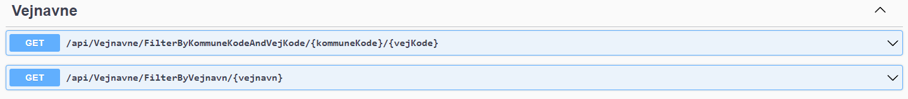
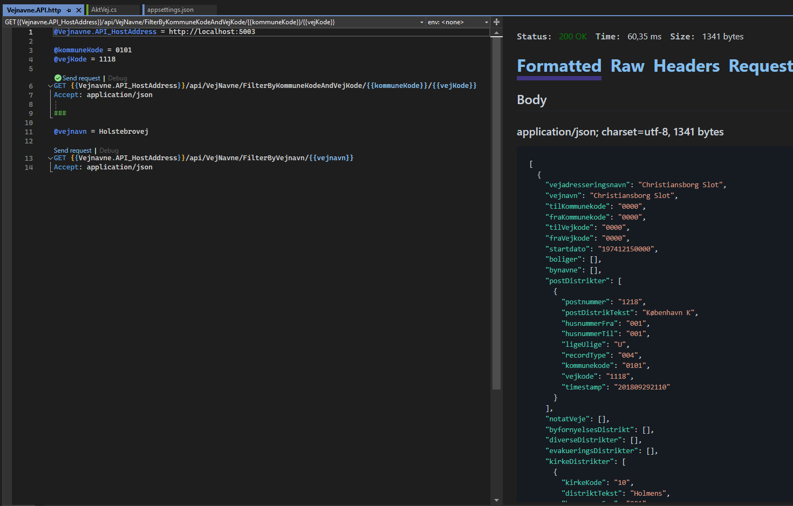
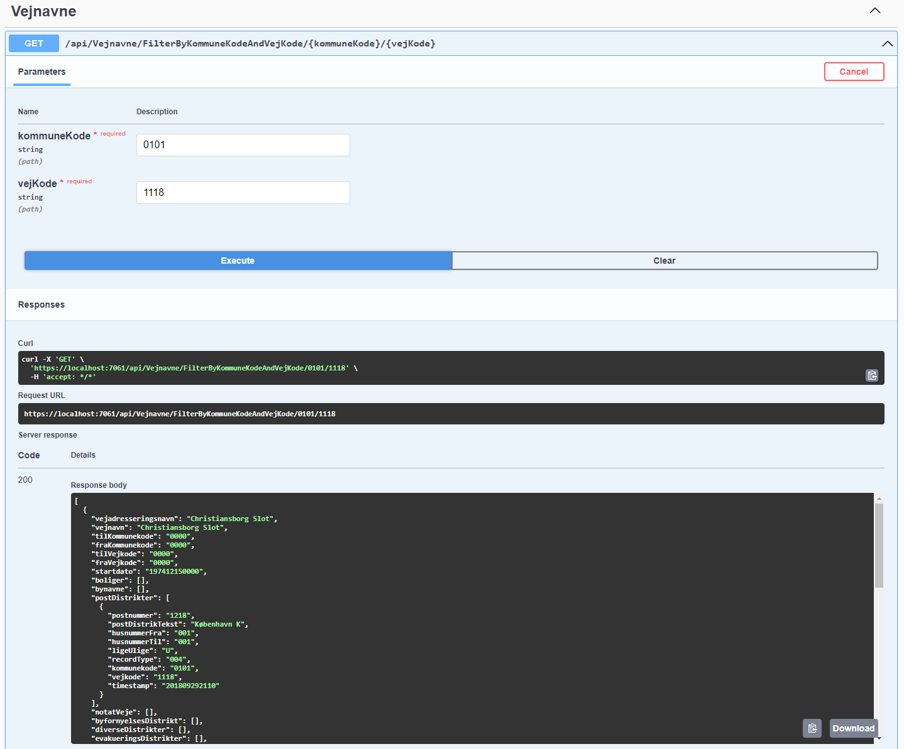
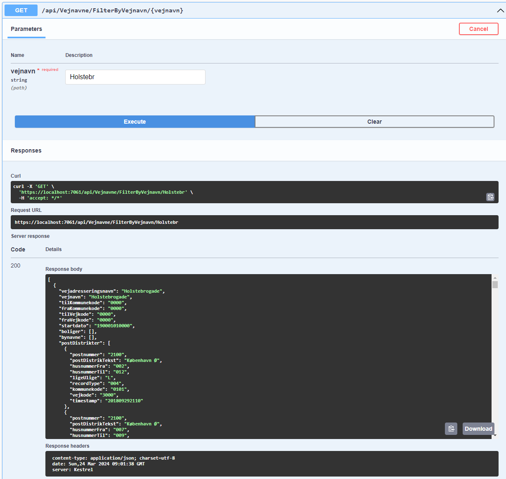

# Vejnavne - Opgave til uge 4 på systemintegration
Lavet i .NET 8.

Løsningen har to endpoints

Datafilen er ikke inkluderet i på projektet. 

Datafilen kan hentes [her](https://cpr.dk/Media/638451600706024069/Vejregister_hele_landet_pr_240301.zip)

Beskrivelse af datafilen kan ses [her](https://cpr.dk/media/12197/udtraeksbeskrivelse-vejregister.pdf)

## Opsætning inden kørsel
Man skal sætte stien til datafilen i appsettings.json `DataFilePath`.

## Kørsel af løsningen via http-file
Åbn `Vejnavne.API.http` filen i Vejnavne.API projektet i Visual Studio.

Klik på *Send request* og se svaret.

## Kørsel af løsningen via swagger
Løsningen kan testes via swagger.

